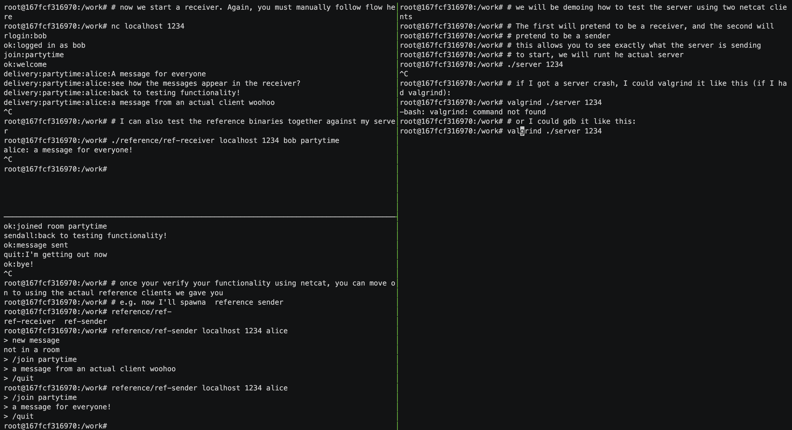

<!-- 

<a href="https://www.jingman-wang.me/en/about/#skills" class="external-link" target="_blank"> check Michelle's skills
</a>

 -->

  <a href="#intern" style="padding: 10px 15px; text-decoration: none; color: black; font-weight: bold; border-right: 1px solid #dee2e6;">Intern</a>
  <a href="#experience" style="padding: 10px 15px; text-decoration: none; color: black; font-weight: bold; border-right: 1px solid #dee2e6;">Experience</a>
  <a href="#projects" style="padding: 10px 15px; text-decoration: none; color: black; font-weight: bold; border-right: 1px solid #dee2e6;">Projects</a>
  <a href="#awards" style="padding: 10px 15px; text-decoration: none; color: black; font-weight: bold;">Awards</a>

_* <u>click each card to expand_</u>

## 
MY STARTUP!!!

  
  

    <!-- goosecart with light orange color and centered -->
    
GooseCart

    
YOUR NEIGHBORHOOD MARKETPLACE

    
Flock Together for Local Deals!

    

      Connect with us:
      <a href="https://www.goose-cart.com/" class="connection-link" target="_blank">Website</a>
       | 
      <a href="https://www.linkedin.com/company/goosecart/" class="connection-link" target="_blank"> LinkedIn</a>
    

  

## 
Intern

  <h3>Hull Street Energy</h3>
  
  

    Postgres
    SQL
    PgAdmin
    Python
    Excel Addin
    LLM
    Langchain
  

  

    
<strong>Position:</strong> Strategist & Software Engineer | <strong>Year:</strong> 05/2024 - 08/2024

    <ul>
      <li>Created and maintained a comprehensive database and server for gas and power markets, aggregating key data such as trade contracts and ICE/Platts data. Built applications and Excel add-ins to visualize and analyze these datasets, supporting strategic decision-making.</li>
      <li>Strategically managed operational variables of power plants, including heat rate, ramp rate, and state variables (hot, warm, cold), to maximize gross margins. Leveraged quantitative analysis and Hull Street Energy’s extensive expertise in both renewable and fossil fuel power generation.</li>
      <li>Spearheaded the development of a personalized large language model assistant using AI and NLP, integrated with a proprietary database. This innovative tool provided customized insights and enhanced the analytical capabilities of the energy sector.</li>
    </ul>
  

  <h3>DearYou Health</h3>
  
  

    React Native
    TensorFlow
    Firebase
    Git Version Control
  

  

    
<strong>Position:</strong> Tech Board Lead | <strong>Year:</strong> 01/2024 - 05/2024

    <!-- Your detailed content for Project Name 1 goes here -->
    
<strong>Overview:</strong> DearYou Health is a youth-powered nonprofit dedicated to providing culturally-competent mental health support to underrepresented high school and college students, bridging connections to various therapy modalities and fostering an inclusive environment for prioritizing well-being.

    
<strong>Key Contributions:</strong>

    <ul>
      <li>Cross-Platform Compatibility: Spearheaded the tech team in utilizing React Native to ensure seamless user experience across various devices.</li>
      <li>AI-Driven Matching Algorithm: Implemented a sophisticated AI algorithm utilizing TensorFlow for precise matching of students with suitable counselors/therapists. This involved intricate neural network design and parameter fine-tuning to achieve exceptional accuracy and efficiency.</li>
      <li>Enhanced Functionality: Integrated Firebase for secure user authentication and data storage. Incorporated third-party APIs to verify therapist credentials, ensuring user safety and enhancing app functionality.</li>
    </ul>
  

## 
Experience

  <h3>JHU Delineo (demo in descripion)</h3>
  
  

    Python
    Unreal Engine 5
    AWS SimSpace Weaver
    React
    Mass Crowd AI
  

  

    
<strong>Year:</strong> 08/2023 - Current

    <!-- Your detailed content for Project Name 1 goes here -->
    
<strong>Overview:</strong> The Delineo Disease Modeling Project aims to revolutionize infectious disease spread modeling by creating a massively parallel, scalable system. Our goal is to assess the impact of non-pharmaceutical interventions (NPIs) and events on disease spread, envisioning populations in highly localized "modules" comprising people, dwellings, and community spaces.

    
<strong>Key Contributions:</strong>

    <ul>
      <li>Designed and integrated features in the new algorithm enabling the retrieval of disease information and real-time tracking of disease timelines for newly infected individuals, enhancing the accuracy and reducing the simulation time by 20%.</li>
      <li>Collaborated with AWS to integrate Mass Crowd AI for simulating crowd movement and infection patterns in airports on UE5, enhancing disease spread modeling accuracy.</li>
      <li>Utilized AWS SimSpace Weaver and the social force model to run and visualize a spatial simulation of approximately 240,000
      entities moving between facilities and simulating the spread of disease.</li>
      <li>Developed the "Intervention Manager" module, allowing users to define and apply interventions within simulations, utilizing Python for backend logic and React for frontend implementation.</li>
    </ul>
    
This is a demo of the airport simulation working with AWS.

    <video controls width="300">
      <source src="predefined_path_spawn.mp4" type="video/mp4">
    </video>
  

  <h3>VisualScore</h3>
  
  

    React Native
    Python
    Python Library neoscore
  

  

    
<strong>Position:</strong> Open-Source Software Developer | <strong>Year:</strong> 03/2024 - Current

    <!-- Your detailed content for Project Name 1 goes here -->
    
<strong>Overview:</strong> In collaboration with OSPO's FOSSProF and supported by the Peabody Launch Grant, VisualScore is an innovative open-source project aimed at revolutionizing digital sheet music creation. This project leverages the neoscore Python library to offer composers unprecedented flexibility and ease in creating digital scores through an intuitive drag-and-drop interface.

  
  

  <h3>Quest2Learn</h3>
  
  

    Unity
    React3Fiber
    React
    ARKit
    Git Version Control
  

  

    
<strong>Position:</strong> Software and UI/UX Engineer | <strong>Year:</strong> 01/2023 - 10/2023

    <!-- Your detailed content for Project Name 1 goes here -->
    
<strong>Overview:</strong> Quest2Learn revolutionizes science education by transforming any environment into an immersive laboratory through augmented reality.

    
<strong>Key Contributions:</strong>

    <ul>
      <li>Cutting-Edge Technologies: Utilized Unity and React3Fiber to create immersive AR environments with hyperrealistic 3D model construction and interactive functionalities.</li>
      <li>University Collaboration: Collaborated with CUHK University in Hong Kong to design user-centered modules, combining React for frontend development and Unity for interactive simulations.</li>
      <li>Enhanced User Satisfaction: Resulted in a significant 15% improvement in user satisfaction through the seamless integration of technology and user-centered design principles.</li>
    </ul>
    
<strong>Testing and Optimization:</strong>

    <ul>
      <li>Conducted comprehensive unit, system, and usability testing to ensure app functionality and optimization.</li>
      <li>Gathered insights through user interviews, refining the user experience to achieve maximum engagement and satisfaction.</li>
    </ul>
  

  <h3>JHU CBID VectorCam</h3>
  
  

    Java
    Android Studio
    Firestore
    Computer Vision
  

  

    
<strong>Year:</strong> 06/2023 - 08/2023

    <!-- Your detailed content for Project Name 1 goes here -->
    
<strong>Overview:</strong> A portable, easy-to-use field tool that allows entomologists to accurately speciate different mosquito species to help malaria intervention efforts.

    
<strong>Key Contributions:</strong>

    <ul>
      <li>Developed an Android app for vector surveillance, providing vector control in malaria prevention and elimination in sub-Saharan Africa. Leveraged Java and Android Studio to improve mosquito classification accuracy.</li>
      <li>Engineered a robust Firebase-based data transmission system, ensuring secure and efficient transfer of user-generated mosquito data to the cloud, with offline functionality for data integrity in challenging conditions.</li>
      <li>Implemented advanced image processing and computer vision technique (YOLO - you only look once) for rapid mosquito analysis, resulting in a remarkable 40% accuracy improvement.</li>
    </ul>
  

  <h3>Course Assistant for User Interface Mobile Application</h3>
  

    Java
    Android Studio
    Firebase
    Figma
  

  

    
<strong>Year:</strong> 01/2024 - Current

    <!-- Your detailed content for Project Name 1 goes here -->
    
<strong>Overview:</strong> Debugging code for students, conducting UI/UX research, hosting office hours for student support, and participating in educational team meetings to enhance the learning experience.

  

## 
Projects

  <h3>NLP Tagging Project</h3>
  
  

    NLP
    HMM
    CRF
    Python
  

  

    
<strong>Year:</strong> 10/2023 - 11/2023

    <!-- Your detailed content for Project Name 1 goes here -->
    
<strong>Overview:</strong> Attained over 95% accuracy in tag prediction utilizing taggers based on HMM and CRF, incorporating a biRNN for context feature extraction.

  

  <h3> Swarm Intelligence Simulation with Robotarium</h3>
  

    MATLAB
    Robotarium
  

  

    
<strong>Year:</strong> 02/2024 (demo in description)

    
<strong>Overview:</strong> 
    The Swarm Intelligence Simulation Project focuses on the simulation of complex swarm behaviors among robots, leveraging MATLAB and the Robotarium toolkit. It explores the intricate dynamics of repulsion, orientation, and attraction within artificial swarm intelligence systems.
    

    <video controls width="300">
      <source src="robotarium.mov" type="video/mp4">
    </video>
  

  <h3>Chat Room</h3>
  

    C++
  

  

    
<strong>Year:</strong> 4/2023 (demo in description)

    <!-- Your detailed content for Project Name 1 goes here -->
    
<strong>Overview:</strong> The chat client program delivers real-time, synchronous communication through TCP/IP protocol, ensuring robust and efficient message exchanges. Advanced synchronization techniques, including mutexes, guard objects, and semaphores, are employed to maintain harmony between multiple threads.

    
  

  <h3>Where2Eat</h3>
  

    Java
    Android Studio
  

  

    
<strong>Year:</strong> 02/2023 - 05/2023

    
<strong>Overview:</strong> 
    <ul>
      <li>Streamlines group meal planning by recommending dining spots based on collective preferences, eliminating repetitive communication.</li>
      <li>Utilizes advanced analysis of individual preferences within any group (friends, colleagues) to ensure an optimal dining experience for all.</li>
    </ul>    
    

  

## 
Awards

<ul>
  <li>Awarded a $4,500 grant for GooseCart at the third annual FastForward U Summer Incubator, Johns Hopkins University.
  </li>
  <li>Recipient of the 2023 Dean’s Design Award and the Singhal Family Entrepreneurship Award, securing $20,000 in funding for Quest2Learn.</li>
  <li>Earned a presentation slot at the 2022 ASCEND conference with my proposal with Nathaniel Gordon, titled "Spacecraft Diagnostic Generation from Remote Sensing for OSAM Mission”.</li>
</ul>